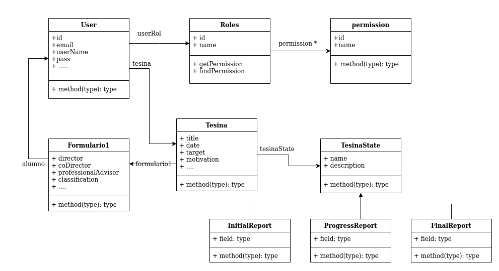

# TesinaAdmMVC
Proyecto ABM de tesinas y Usuarios con Administración de Roles y Permisos para cada
usuario

Diagrama UML

Descripcion de Roles y Persmisos

##### administrador 
> * all
				

##### personal administrativo
> * usuario_accept
> * tesina_finish
> * tesina_show
> * usuario_update			
> * usuario_show		

##### alumno	
> * tesina_new
> * tesina_update
> * tesina_finish
> * tesinas_Show
> * usuario_update
> * usuario_show				

##### invitado
> * usuario_update
> * usuario_show	

Los usuarios Admin pueden pueden agregar mas roles y mas permisos y asignar roles a nuevos usuarios

